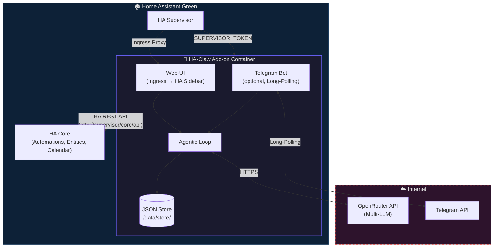

# HA-Claw: System-Architektur (v2 – HA Add-on)

> **Version:** 0.2.0 – Add-on Architecture  
> **Datum:** 2026-03-26

---

## 1. Architektur-Übersicht



## 2. Vorteile gegenüber Standalone-Pi

| Aspekt | Standalone Pi | HA Add-on |
|--------|--------------|-----------|
| Install | Manuelles Bash-Skript + Systemd | 1-Click via Add-on Store |
| HA-Zugriff | Long-Lived Token über Tailscale | `SUPERVISOR_TOKEN` (auto-injected) |
| Updates | `git pull` + restart | Add-on Update Button in HA UI |
| Backup | Eigener Google Drive Sync | HA-Backup sichert `/data/` automatisch |
| Web-UI | Separater Port (127.0.0.1) | Ingress: eingebettet in HA Sidebar |
| Netzwerk | Tailscale Mesh nötig | Alles lokal auf demselben Host |

## 3. Datenstruktur

```
/data/                          # HA-managed persistent volume
├── options.json                # Add-on config (written by HA Supervisor)
└── store/
    ├── notes/                  # Wissen & Notizen
    │   ├── a1b2c3d4.json
    │   └── ...
    ├── conversations/          # Chat-Verlauf
    │   └── ...
    └── memory/                 # Agent-Langzeitgedächtnis
        └── butler.json
```

## 4. Phasenplan (Add-on Edition)

### Phase 0 ✅ – Foundation & Security
- Add-on Skeleton (Dockerfile, config.yaml, repository.yaml)
- Config aus `/data/options.json`
- JSON-Store mit atomaren Writes
- Ingress Web-UI + REST API
- Optionaler Telegram Bot mit Whitelist
- Secret-Redaktion in Logs, 0 TypeScript-Fehler

### Phase 1 – Agentic Loop
- OpenRouter Integration
- Tool Registry + Agentic Loop mit `MAX_ITERATIONS`
- Safety Gate (Telegram Confirmation)

### Phase 2 – HA Integration
- HA-Services über Supervisor API aufrufen
- Google Calendar über HA lesen
- Butler Agent mit HA-Tools

### Phase 3 – Web Dashboard
- Full SPA Dashboard via Ingress
- Agent Config Editor, Log Viewer
- Notes / Memory Browser

### Phase 4 – Polish & Publish
- Multi-Arch Docker Build (aarch64 + amd64)
- CHANGELOG, Versioning
- Publish als öffentliches Add-on Repository
